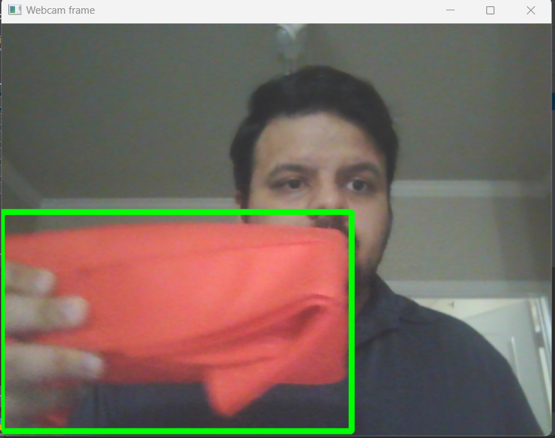
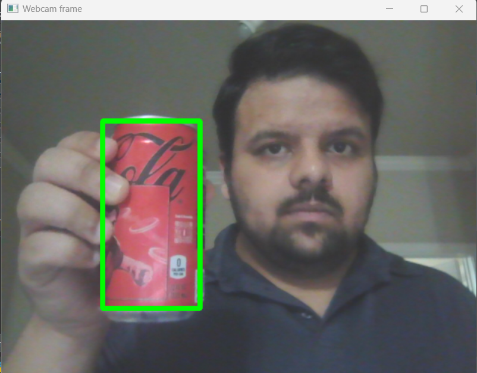
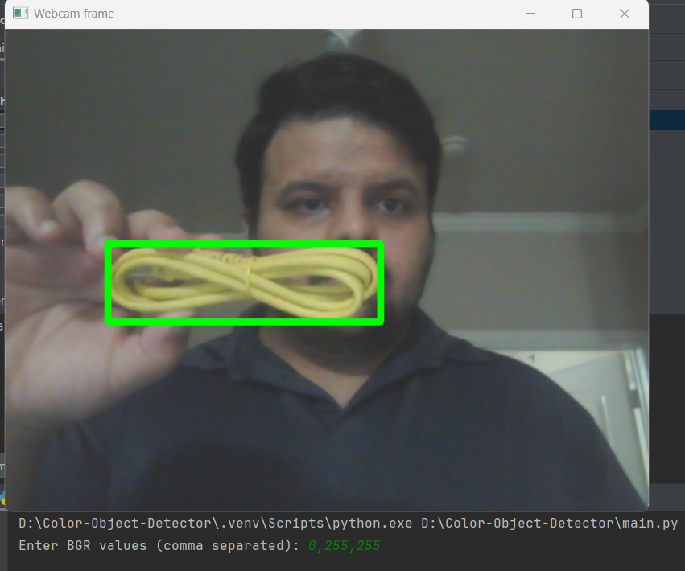

# DynamicColorDetection

This project is a dynamic color detection tool that can track any color in real-time from a webcam feed. The target color is specified by the user in the BGR (Blue, Green, Red) format.

[Additional Details](https://www.notion.so/Portfolio-Projects-SRL-83d36d9c198b409b8ec6a798b2df68d4?p=a63d39393d4b444f964cf7bf1057dd81&pm=c)

## Features

- Detects and tracks any user-specified color from the webcam feed.
- Dynamically handles colors including edge cases like red which have hue wrap-around in the HSV color space.
- Draws bounding boxes around the detected color regions in the video feed.

## Installation

1. Clone the repository:
    ```bash
    git clone https://github.com/yourusername/DynamicColorDetection.git
    cd DynamicColorDetection
    ```

2. Create and activate a virtual environment (optional but recommended):
    ```bash
    python -m venv venv
    source venv/bin/activate  # On Windows use `venv\Scripts\activate`
    ```

3. Install the required dependencies:
    ```bash
    pip install -r requirements.txt
    ```

    **Dependencies:**
    - OpenCV (cv2)
    - NumPy
    - Pillow

4. Run the program:
    ```bash
    python main.py
    ```

## Usage

1. **Input Color:** When you run the program, you'll be prompted to enter the BGR values for the color you wish to detect. Please enter these values separated by commas (e.g., for red, enter `0,0,255`).

2. **Webcam Feed:** The webcam feed will open, and you'll see boxes drawn around the detected color.

3. **Press 'q' to Quit:** To stop the webcam feed and close the application, press the `q` key.

## Code Explanation

### get_limits Function

```python
import numpy as np
import cv2 as cv

def get_limits(color):
    c = np.uint8([[color]])
    hsvC = cv.cvtColor(c, cv.COLOR_BGR2HSV)
    hue_value = hsvC[0][0][0]
    
    if 160 <= hue_value <= 180 or 0 <= hue_value <= 20:
        lower_limit_1 = np.array([max(hue_value - 10, 0), 100, 100], dtype=np.uint8)
        upper_limit_1 = np.array([min(hue_value + 10, 179), 255, 255], dtype=np.uint8)
        lower_limit_2 = np.array([(hue_value + 170) % 180, 100, 100], dtype=np.uint8)
        upper_limit_2 = np.array([min((hue_value + 190) % 180, 179), 255, 255], dtype=np.uint8)
        return (lower_limit_1, upper_limit_1), (lower_limit_2, upper_limit_2)
    else:
        lower_limit = np.array([max(hue_value - 10, 0), 100, 100], dtype=np.uint8)
        upper_limit = np.array([min(hue_value + 10, 179), 255, 255], dtype=np.uint8)
        return (lower_limit, upper_limit), None
```

### Main Code

```python
import cv2 as cv
import numpy as np
from utils import get_limits  # Assuming utils is the name of your file/module
from PIL import Image

def get_color_from_user():
    color_input = input("Enter BGR values (comma separated): ")
    color = list(map(int, color_input.split(',')))
    if len(color) != 3:
        raise ValueError("Please provide exactly 3 integers for BGR values.")
    return color

target_color = get_color_from_user()

cam = cv.VideoCapture(0)

while True:
    retval, frame = cam.read()
    if not retval:
        break

    hsv_img = cv.cvtColor(frame, cv.COLOR_BGR2HSV)
    limits_1, limits_2 = get_limits(target_color)
    lower_limit_1, upper_limit_1 = limits_1
    mask1 = cv.inRange(hsv_img, lower_limit_1, upper_limit_1)
    
    if limits_2 is not None:
        lower_limit_2, upper_limit_2 = limits_2
        mask2 = cv.inRange(hsv_img, lower_limit_2, upper_limit_2)
        mask = cv.bitwise_or(mask1, mask2)
    else:
        mask = mask1

    mask_pil = Image.fromarray(mask)
    bbox = mask_pil.getbbox()
    
    if bbox is not None:
        x1, y1, x2, y2 = bbox
        frame = cv.rectangle(frame, (x1, y1), (x2, y2), (0, 255, 0), 5)
    
    cv.imshow('Webcam frame', frame)

    if cv.waitKey(1) & 0xFF == ord('q'):
        break

cam.release()
cv.destroyAllWindows()
```

### Additional Files:
- `requirements.txt`

```
opencv-python
numpy
Pillow
```

## Screenshots:
- ### Red:
- 
- 

- ### Yellow
- 
